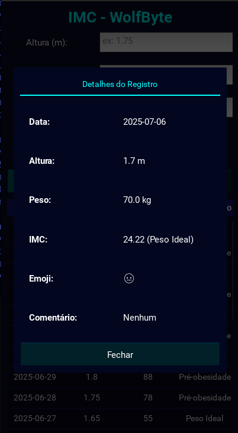
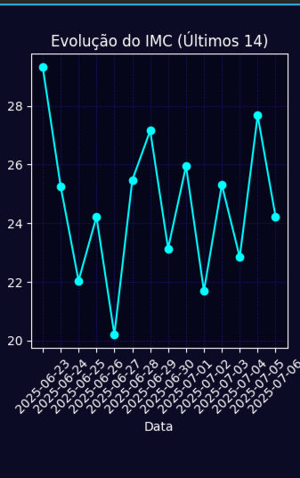

# 🐺 IMC-WolfByte

**IMC-WolfByte** é um aplicativo móvel desenvolvido com Python e Kivy para cálculo, registro e acompanhamento da evolução do **Índice de Massa Corporal (IMC)**. A aplicação permite que usuários salvem seus dados diários de peso e altura, adicionem comentários e emojis representando seu estado emocional, e visualizem a evolução do IMC em gráficos e tabelas de forma prática, offline e visual.

---

## Sumário

1. [Integrantes da Empresa](#integrantes-da-empresa)
2. [Funcionalidades](#funcionalidades)
3. [Estrutura do Projeto](#estrutura-do-projeto)
4. [Tecnologias Utilizadas](#tecnologias-utilizadas)
5. [Capturas de Tela](#capturas-de-tela)
6. [Guia de Instalação e Execução](#guia-de-instalação-e-execução)
7. [Licença](#licença)

---

## Integrantes da Empresa

- **Cleiton Guilhermite** - Desenvolvimento Front-end / Requisitos [GitHub](https://github.com/Draky-Rollgard)
- **Leonardo Araújo** - Desenvolvimento Back-end / Banco de dados [GitHub](https://github.com/LeoAboard)
- **Stefany Silva** - Desenvolvimento Front-end / Design [GitHub](https://github.com/stefanytk)
- **Luiz F. Miranda** - Desenvolvimento FullStack [GitHub](https://github.com/lfelipemi)

---

## Funcionalidades

- ✅ Cálculo automático e preciso do IMC
- ✅ Classificação baseada nas faixas da OMS
- ✅ Registro com emojis e comentários personalizados
- ✅ Histórico interativo com ordenação por data
- ✅ Gráfico com os últimos 14 registros
- ✅ Totalmente funcional offline
- ✅ Interface leve, responsiva e amigável para Android

---

## Estrutura do Projeto

```
imc_app
├── main.py # Arquivo principal da aplicação
├── imcwolfbyte.kv # Layout visual da interface
├── dados_imc.json # Armazenamento local dos registros
├── grafico_imc.png # Gráfico gerado dinamicamente
├── assets/
│ ├── fonts/ # Fontes personalizadas (.ttf)
│ └── images/ # Ícones e imagens
├── bin/ # APKs gerados
├── hooks/ # Scripts auxiliares (pyjnius patch)
├── buildozer.spec # Configuração para compilação Android
└── requirements.txt # Dependências do projeto
```

---

## Tecnologias Utilizadas

- [x] Python 3.11
- [x] Kivy
- [x] Kivy Garden Matplotlib
- [x] JSON (armazenamento local)
- [x] Buildozer (empacotamento Android)
- [x] Fontes: Roboto + NotoEmoji

---

## Capturas de Tela

> 
> 
> 

---

## Guia de Instalação e Execução

### 1. Clone o Repositório

```bash
git clone <url-do-seu-repositorio>
cd <nome-da-pasta-do-projeto>
```

### 2. Crie um Ambiente Virtual (Recomendado)

```bash
python -m venv .venv
source .venv/bin/activate  # No Windows: venv\Scripts\activate
```

### 3. Instale as Dependências

```bash
pip install -r requirements.txt
```

> **Nota:** Se ocorrer erro ao usar gráficos, instale o módulo manualmente:
> ```bash
> pip install kivy-garden.matplotlib
> ```

### 4. Estrutura de Fontes

Certifique-se de que a seguinte estrutura exista:

```
assets/fonts/NotoEmoji-Regular.ttf
```

A fonte pode ser baixada em: [Noto Emoji - Google Fonts](https://fonts.google.com/noto/specimen/Noto+Emoji)

---

### 5. Execute a Aplicação

```bash
python main.py
```

---

## 📱 Implantação (Build para Android)

A compilação para Android é feita utilizando a ferramenta **Buildozer**.

### 6. Instale o Buildozer

```bash
pip install buildozer
```

### 7. Inicialize o Buildozer

```bash
buildozer init
```

Isso criará o arquivo `buildozer.spec`, que deve ser configurado com as informações da sua aplicação (título, nome do pacote, requisitos, etc.).

### 8. Aplique o Patch (Passo Crítico)

Execute o script de patch para corrigir o problema com o Pyjnius:

```bash
chmod +x patch_pyjnius.sh
./patch_pyjnius.sh
```

> Este passo deve ser executado **após** a primeira tentativa de build ou após o Buildozer baixar as dependências Android.

### 9. Compile o APK

```bash
buildozer -v android debug
```

O APK gerado estará disponível na pasta `bin/`.

---

## Licença

Este projeto é distribuído sob a licença MIT. Consulte o arquivo `LICENSE` para mais detalhes.

---

## Contribuições

Contribuições, sugestões e melhorias são sempre bem-vindas!

---